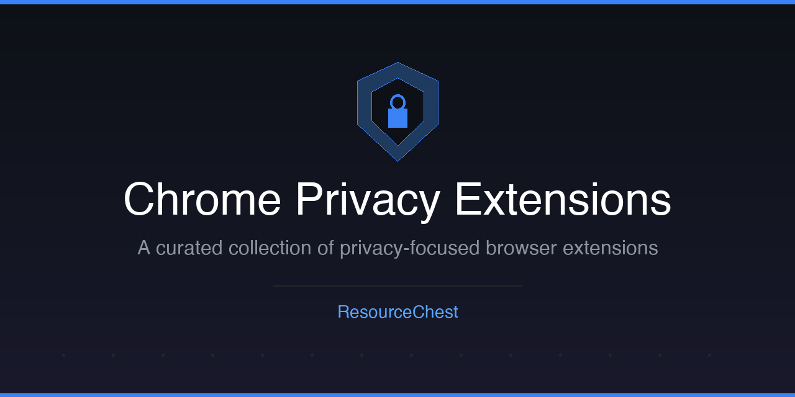

  

# Chrome Privacy Extensions

A curated list of Chrome extensions that protect your privacy and improve your browsing experience. Every extension listed here is available on the Chrome Web Store and has been vetted for usefulness.

> **Why privacy?** Your browsing data reveals your interests, habits, location, and identity. Trackers, ads, and data brokers collect this information at scale, often without meaningful consent. These extensions help you take back control.

## Contents

- [Ad Blocking](#ad-blocking)
- [Tracker Protection](#tracker-protection)
- [URL & Link Protection](#url--link-protection)
- [Privacy Utilities](#privacy-utilities)
- [VPN](#vpn)
- [Contributing](#contributing)
- [Disclaimer](#disclaimer)

## Ad Blocking

- [**uBlock Origin**](https://chromewebstore.google.com/detail/ublock-origin/cjpalhdlnbpafiamejdnhcphjbkeiagm) - An efficient, wide-spectrum content blocker that is easy on memory and CPU. *(Note: Chrome is phasing out Manifest V2 extensions. uBlock Origin may become unavailable in future Chrome versions. See uBlock Origin Lite below as the MV3 alternative.)*
- [**uBlock Origin Lite**](https://chromewebstore.google.com/detail/ublock-origin-lite/ddkjiahejlhfcafbddmgiahcphecmpfh) - The Manifest V3 compatible version of uBlock Origin, built to work within Chrome's newer extension framework.
- [**Ghostery**](https://chromewebstore.google.com/detail/ghostery/mlomiejdfkolichcflejclcbmpeaniij) - Blocks ads, stops trackers, and speeds up websites. Includes detailed tracker information for every page you visit.

## Tracker Protection

- [**Privacy Badger**](https://chromewebstore.google.com/detail/privacy-badger/pkehgijcmpdhfbdbbnkijodmdjhbjlgp) - Developed by the EFF, automatically learns to block invisible trackers based on their behavior.
- [**ClearURLs**](https://chromewebstore.google.com/detail/clearurls/lckanjgmijmafbedllaakclkaicjfmnk) - Automatically removes tracking elements from URLs to protect your privacy when clicking links.
- [**LocalCDN**](https://chromewebstore.google.com/detail/localcdn/njdfdhgcmkocbgbhcioffdbicglldapd) - Emulates CDN frameworks and libraries locally, preventing unnecessary third-party requests that can be used for tracking.
- [**Decentraleyes**](https://chromewebstore.google.com/detail/decentraleyes/ldpochfccmkkmhdbclfhpagapcfdljkj) - Protects against tracking through content delivery networks by serving local files instead of fetching from third parties.

## URL & Link Protection

- [**Unshorten.link**](https://chromewebstore.google.com/detail/unshortenlink/gbobdaaeaihkghbokihkofcbndhmbdpd) - Unshortens URLs to reveal their true destination, protecting you from phishing, malware, and spyware hidden behind short links.

## Privacy Utilities

- [**Click & Clean**](https://chromewebstore.google.com/detail/clickclean/ghgabhipcejejjmhhchfonmamedcbeod) - Deletes browsing history, typed URLs, Flash cookies, and other browsing data with one click.
- [**Cookie AutoDelete**](https://chromewebstore.google.com/detail/cookie-autodelete/fhcgjolkccmbidfldomjliifgaodjagh) - Automatically deletes unused cookies when a tab is closed, keeping only the ones you trust.
- [**User-Agent Switcher for Chrome**](https://chromewebstore.google.com/detail/user-agent-switcher-for-c/djflhoibgkdhkhhcedjiklpkjnoahfmg) - Quickly switch between different user-agent strings to reduce browser fingerprinting.
- [**Behind The Overlay**](https://chromewebstore.google.com/detail/behind-the-overlay/ljipkdpcjbmhkdjjmbbaggebcednbbme) - Remove annoying pop-ups and overlays from websites with a single click.
- [**Canvas Blocker (Fingerprint Protect)**](https://chromewebstore.google.com/detail/canvas-blocker-fingerprin/nomnklagbgmgghhjidfhnoelnjfndfpd) - Prevents canvas fingerprinting by spoofing canvas API calls, making it harder for sites to uniquely identify your browser.
- [**NoScript**](https://chromewebstore.google.com/detail/noscript/doojmbjmlfjjnbmnoijecmcbfeoakpjm) - Maximum protection for your browser. Allows JavaScript, Flash, and other executable content to run only from trusted domains.

## VPN

- [**Windscribe**](https://chromewebstore.google.com/detail/windscribe-free-proxy-and/hnmpcagpplmpfojmgmnngilcnanddlhb) - A free VPN and proxy that encrypts your internet connection, blocks ads, and changes your virtual location.

## More from ResourceChest

| Repository | Description |
|:--------|:------|
| [Custom GPTs](https://github.com/ResourceChest/custom-gpts) | Community-curated catalog of useful Custom GPTs with ratings |
| [AI Agents](https://github.com/ResourceChest/ai-agents) | Practical AI agents, frameworks, and tools for developers |
| [FinOps Tools](https://github.com/ResourceChest/finops-tools) | Vendor-neutral tools for cloud cost optimization |
| [Local-First Tools](https://github.com/ResourceChest/local-first-tools) | Local-first, offline-capable, privacy-respecting tools |
| [Dev Tools (No Signup)](https://github.com/ResourceChest/dev-tools-no-signup) | Free developer tools that work instantly without an account |

> **[Follow ResourceChest](https://github.com/ResourceChest)** for more curated resource collections.

---

## Contributing

Want to add or suggest a new privacy-focused extension? Check out our [CONTRIBUTING.md](https://github.com/ResourceChest/.github/blob/main/CONTRIBUTING.md) for guidelines. Pull requests are welcome.

## Disclaimer

All extensions listed here are based on personal research and community feedback. We are not affiliated with any of the extensions or their developers. Please conduct your own research and read reviews before installing any extension.
